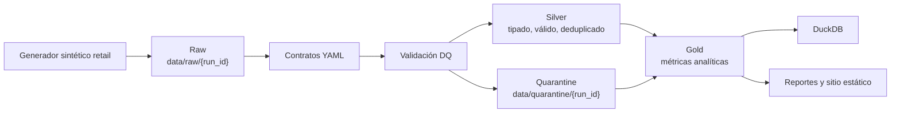
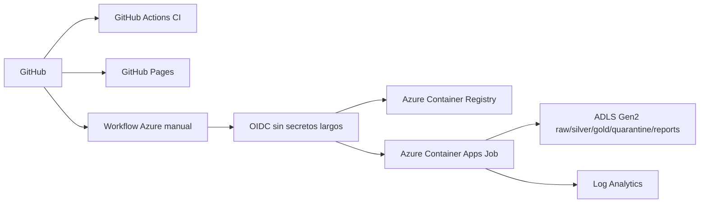

# RetailDQ Lakehouse Pipeline

RetailDQ es un proyecto local-first y cloud-ready de ingeniería de datos batch para transacciones retail/e-commerce sintéticas. Demuestra arquitectura lakehouse tipo medallion, contratos de datos, quality gates, quarantine de inválidos, métricas gold, DuckDB local, Docker, CI/CD y preparación para Azure Container Apps Job.

No usa datos reales, PII, secretos ni recursos cloud reales.

## Resumen Ejecutivo

El pipeline genera datos sintéticos determinísticos, los persiste en raw, valida registros contra contratos YAML, aísla inválidos en quarantine con trazabilidad, construye tablas silver limpias y produce métricas gold y reportes estáticos.

## Problema

La analítica retail falla cuando upstream envía duplicados, valores fuera de catálogo, claves foráneas inexistentes, fechas futuras o montos inválidos. RetailDQ se enfoca en los controles de ingeniería que hacen confiable la analítica posterior.

## Qué Demuestra

- Generación de datos sintéticos sin PII.
- Arquitectura raw, silver y gold.
- Contratos YAML para `customers`, `products`, `stores`, `channels`, `orders` y `order_items`.
- Checks de nulos, unicidad, primary keys, valores aceptados, rangos, freshness, anomalías, fechas futuras e integridad referencial.
- Quarantine con `run_id`, entidad, `record_id`, regla, severidad, razón, timestamp, payload original y capa fuente.
- Metadata incremental por `run_id`.
- DuckDB como warehouse local.
- CLI con Typer, tests, Ruff, Mypy, Docker y Docker Compose.
- GitHub Actions, CodeQL, Dependabot, Release Please, GitHub Pages y workflow manual para Azure.

## Arquitectura



## Mapeo Azure



La infraestructura Azure está como Bicep y documentación. No se desplegó nada.

## Por Qué No Es Solo Un Dashboard

El valor está en el pipeline: contratos, quality gates, quarantine, incrementalidad, CI/CD, Docker, seguridad y preparación cloud. El sitio estático solo muestra resultados sintéticos generados por el pipeline.

## Quickstart Local

```powershell
python -m venv .venv
.\.venv\Scripts\python.exe -m pip install --upgrade pip
.\.venv\Scripts\pip.exe install -e ".[dev]"
.\.venv\Scripts\retaildq.exe demo --config configs/local.yaml
```

## Docker

```bash
docker build -t retaildq-lakehouse .
docker run --rm retaildq-lakehouse retaildq --help
docker compose run --rm retaildq retaildq demo --config configs/docker.yaml
```

## Calidad y Quarantine

Los registros inválidos no rompen el batch ni entran a silver. Se guardan en `data/quarantine/{run_id}` con trazabilidad y se resumen en reportes gold.

## Procesamiento Incremental

Cada ejecución tiene `run_id`. Los outputs se particionan por run y no pisan ejecuciones anteriores salvo limpieza explícita. Los watermarks se guardan en `data/_metadata/watermarks.json`.

## Seguridad y Costos

No hay secretos ni PII. Azure usa OIDC y placeholders. Local cuesta $0 MXN. Azure solo genera costo si después se ejecuta manualmente el despliegue.

## Limitaciones

- Datos sintéticos batch.
- Sin streaming en tiempo real.
- Sin despliegue real a Azure.
- Sin dashboard interactivo en V1.
- Observabilidad local, no suite enterprise completa.

## Bullets CV

- Construí un pipeline lakehouse retail con Python, Polars, DuckDB, contratos, quality gates, quarantine y métricas gold.
- Implementé CI/CD con pytest, coverage, Ruff, Mypy, Docker, CodeQL, Dependabot, Release Please y GitHub Pages.
- Diseñé preparación Azure con Bicep, OIDC, Container Apps Job, ACR, ADLS Gen2, seguridad y control de costos.

## Pitch de Entrevista

RetailDQ demuestra cómo construir un pipeline batch confiable: genera datos sintéticos, aterriza raw por `run_id`, valida contratos, aísla inválidos, construye silver y publica gold. La parte cloud está preparada pero protegida para que ningún recurso se cree sin aprobación humana.
