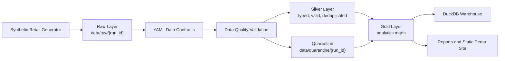
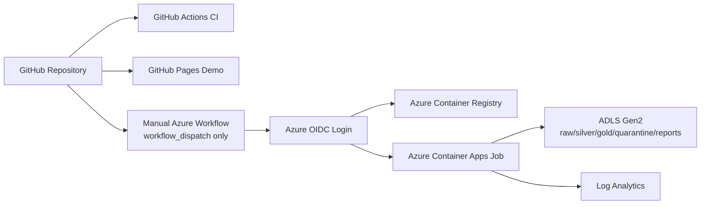

# RetailDQ Lakehouse Pipeline


**Live demo:** https://bgia1.github.io/retailops-dq-pipeline/  
**Latest release:** https://github.com/BGIA1/retailops-dq-pipeline/releases/tag/v0.2.0  
**Status:** Local-first, cloud-deployment-ready, not cloud-deployed.

RetailDQ is a local-first, cloud-ready batch data engineering project for synthetic retail/e-commerce transactions. It demonstrates a production-style lakehouse pipeline with raw, silver, and gold layers; YAML data contracts; data quality gates; invalid record quarantine; DuckDB registration; local observability; Docker packaging; GitHub Actions; and Azure Container Apps Job deployment readiness.

No real customer data, PII, secrets, or cloud resources are used.

## Executive Summary

The pipeline generates deterministic synthetic retail data, persists it to a raw lakehouse layer, validates records against contracts and quality rules, isolates bad records in quarantine with traceability, builds clean silver tables, and produces gold analytical metrics and static demo reports.

It is designed to show data platform engineering judgment: data contracts, quality thresholds, referential integrity, incremental run metadata, reproducible CLI execution, CI/CD validation, containerization, and secure Azure deployment preparation.

## Problem Statement

Retail analytics often breaks when upstream transaction data contains duplicates, invalid catalog values, missing foreign keys, future dates, or bad numeric values. A dashboard alone hides these risks. RetailDQ focuses on the batch pipeline controls that make downstream analytics trustworthy.

## What This Project Demonstrates

- Synthetic data generation without PII.
- Medallion lakehouse architecture: raw, silver, gold.
- YAML data contracts for six retail entities.
- Null, uniqueness, primary key, accepted value, numeric range, freshness, anomaly, future date, and referential integrity checks.
- Invalid record quarantine with `run_id`, `entity`, `record_id`, `rule_id`, severity, timestamp, reason, payload, and source layer.
- Incremental-style run metadata and watermarks.
- DuckDB-backed local warehouse tables.
- Gold marts for revenue, order KPIs, top products, DQ summaries, and run metadata.
- Typer CLI, pytest coverage, Ruff, Mypy, Docker, Docker Compose.
- GitHub Actions CI, CodeQL, Dependabot, Release Please, Pages, and manual Azure deployment template.

## Architecture



## Medallion Architecture

- Raw: generated records persisted with minimal transformation and partitioned by `run_id`.
- Silver: typed, validated, deduplicated records with invalid rows removed.
- Gold: consumption-ready metrics and observability summaries.

## Azure-Oriented Production Mapping



The Azure workflow and Bicep files are deployment-ready templates, not executed here. They use OIDC placeholders and require human approval through the `azure-demo` environment.

## Why This Is Not Just a Dashboard

The core value is upstream data reliability: contracts, validation, quarantine, incremental run metadata, CI/CD, Docker, and cloud deployment readiness. The static site is only a demo artifact generated from pipeline outputs.

## Stack

Python 3.11+, DuckDB, Polars, Pandera, SQL, Typer, Pytest, Pytest-cov, Ruff, Mypy, Docker, Docker Compose, GitHub Actions, CodeQL, Dependabot, Release Please, Bicep, Mermaid.

## Local Quickstart

```powershell
python -m venv .venv
.\.venv\Scripts\python.exe -m pip install --upgrade pip
.\.venv\Scripts\pip.exe install -e ".[dev]"
.\.venv\Scripts\retaildq.exe --help
.\.venv\Scripts\retaildq.exe demo --config configs/local.yaml
```

Outputs are written under `data/`, `examples/demo/`, and `site/generated/`.

## Docker Quickstart

```bash
docker build -t retaildq-lakehouse .
docker run --rm retaildq-lakehouse retaildq --help
docker compose run --rm retaildq retaildq demo --config configs/docker.yaml
```

## CLI

```bash
retaildq generate --config configs/local.yaml --seed 42 --days 14 --orders 500 --invalid-rate 0.08
retaildq run --config configs/local.yaml
retaildq validate --config configs/local.yaml
retaildq report --config configs/local.yaml --format all
retaildq demo --config configs/local.yaml
retaildq site-build --config configs/local.yaml
retaildq clean --config configs/local.yaml --yes
```

## Data Contracts

Contracts live in `contracts/` and define columns, types, primary keys, foreign keys, accepted values, nullability, and numeric ranges for:

- `customers`
- `products`
- `stores`
- `channels`
- `orders`
- `order_items`

## Data Quality and Quarantine

Invalid records are not allowed into silver. They are persisted to `data/quarantine/{run_id}/quarantine.parquet` and `.csv` with rule-level traceability. The quality gate fails when the invalid record rate exceeds the configured threshold.

## Incremental Processing

Every execution has a `run_id`. Runs are written to run-partitioned folders and do not overwrite previous runs unless a demo cleanup or explicit clean command is used. Watermarks are stored in `data/_metadata/watermarks.json`.

## Observability

Each run produces:

- `data/gold/{run_id}/data_quality_report.md`
- `data/gold/{run_id}/data_quality_report.json`
- `data/gold/{run_id}/pipeline_run_metadata.json`
- `data/gold/{run_id}/lineage.md`
- `data/_metadata/runs.jsonl`
- DuckDB tables in `data/retaildq.duckdb`

## Repository Structure

```text
src/retaildq/      Pipeline package and CLI
contracts/         YAML data contracts
configs/           Local, CI, Docker, and Azure sample configs
data/              Local generated lakehouse folders
sql/               Silver and gold SQL reference models
tests/             Unit, integration, and data quality tests
docs/              Architecture, quality, security, cost, Azure, portfolio docs
infra/azure/       Bicep templates and guarded scripts
.github/           CI/CD, CodeQL, Pages, Dependabot, Release Please
```

## CI/CD

CI runs Ruff, Ruff format check, Mypy, pytest with coverage, a deterministic RetailDQ demo, and Docker build validation. Pages builds a static synthetic demo. Azure deployment is manual only.

## Security

- No secrets in the repo.
- `.env.example` contains placeholders only.
- No PII is generated.
- Azure uses OIDC placeholders, not long-lived secrets.
- CodeQL and Dependabot are configured.
- Critical deployment workflow requires manual `workflow_dispatch` and `azure-demo` environment review.

## Cost Control

Local execution costs $0 MXN. GitHub Pages/Actions are expected to be $0 within normal included usage. Azure resources cost money only if the manual deployment workflow or scripts are run later. Review budgets before deployment.

## Cloud Deployment Readiness

Bicep models ADLS Gen2-style storage, ACR, Log Analytics, Container Apps Environment, and Container Apps Job. The container is designed for batch execution with DuckDB/Polars inside the job. No Azure deployment has been performed.

## Limitations

- Synthetic batch data only.
- No real-time streaming.
- No FastAPI, Streamlit, Spark, dbt, or Terraform in V1.
- Azure ADLS read/write is prepared through configuration and deployment design, but not exercised locally.
- Observability is local-file based, not a full enterprise monitoring stack.

## Roadmap

- Add optional Azure storage adapter after credentials and target conventions are chosen.
- Add partition pruning and larger-scale benchmark mode.
- Add contract compatibility checks for schema evolution.
- Add richer DQ trend history across runs.
- Add optional dbt models in a future version if project scope requires it.

## CV Bullets

- Built a local-first retail lakehouse pipeline using Python, Polars, DuckDB, data contracts, DQ gates, quarantine, and gold marts.
- Implemented CI/CD validation with pytest coverage, Ruff, Mypy, Docker build checks, CodeQL, Dependabot, Release Please, and GitHub Pages.
- Designed Azure deployment readiness with Bicep, OIDC, Container Apps Job, ACR, ADLS Gen2 mapping, least-privilege guidance, and cost controls.

## Interview Explanation

RetailDQ is a batch data pipeline that treats data quality as a first-class engineering concern. The system generates synthetic retail data, lands it raw by run id, validates it against contracts, quarantines invalid records with traceability, builds clean silver tables, and publishes gold metrics. The CI pipeline proves that quality, typing, tests, and Docker packaging work before deployment. Azure deployment is intentionally manual and uses OIDC so no long-lived cloud secrets are required.
