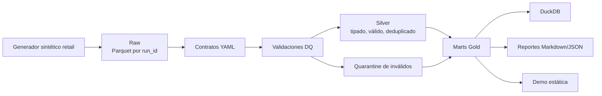
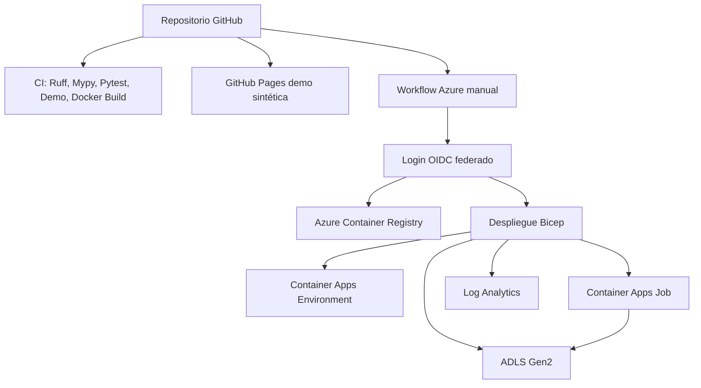

# Arquitectura

RetailDQ es un pipeline lakehouse batch local-first con preparación para Azure Container Apps Job y ADLS Gen2.

## Arquitectura Local

Raw conserva registros válidos e inválidos. Silver solo contiene registros que pasan contratos e integridad referencial. Gold contiene métricas y artefactos de observabilidad.

## Arquitectura Cloud-Ready

El workflow de Azure es manual y protegido por el environment `azure-demo`. No se ejecuta durante la generación local.

## Mapa de Componentes

| Componente | Ruta | Responsabilidad |
| --- | --- | --- |
| Generador | `src/retaildq/generator` | Datos sintéticos determinísticos sin PII |
| Contratos | `contracts/`, `src/retaildq/contracts` | Esquemas, claves, catálogos, rangos |
| Calidad | `src/retaildq/quality` | Reglas, thresholds, quarantine, reportes |
| Lakehouse | `src/retaildq/lakehouse` | Raw, silver, gold, incrementalidad |
| Warehouse | `src/retaildq/warehouse` | Registro de tablas DuckDB |
| Observabilidad | `src/retaildq/observability` | Metadata y lineage |
| Demo | `src/retaildq/demo` | Sitio estático |

## Equivalencias Azure

| Local | Target Azure |
| --- | --- |
| `data/raw` | ADLS Gen2 raw |
| `data/silver` | ADLS Gen2 silver |
| `data/gold` | ADLS Gen2 gold |
| `data/quarantine` | ADLS Gen2 quarantine |
| Imagen Docker | Azure Container Registry |
| CLI batch | Azure Container Apps Job |
| Logs/reportes locales | Log Analytics y ADLS reports |
