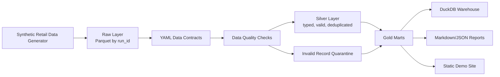
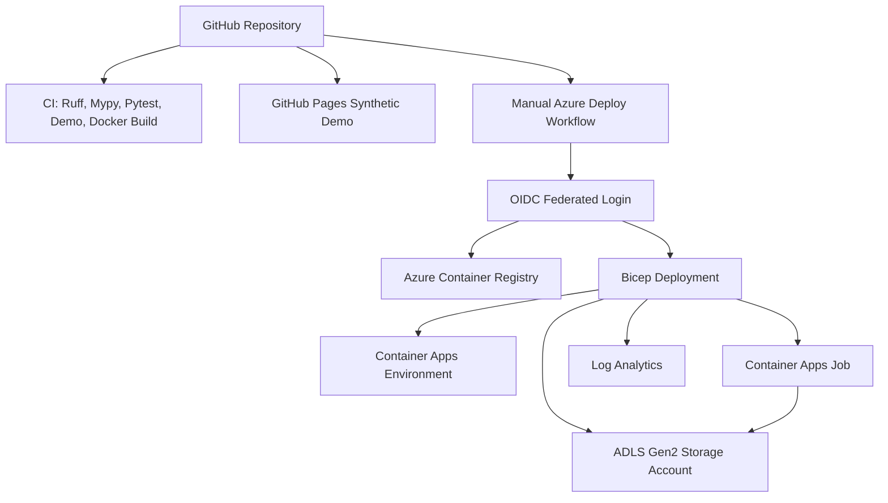

# Architecture

RetailDQ is a local-first batch lakehouse pipeline with cloud deployment readiness for Azure Container Apps Job and ADLS Gen2.

## Local Architecture

Raw preserves generated valid and invalid records. Silver only contains records that pass contract and referential checks. Gold contains metrics and observability artifacts.

## Cloud-Ready Architecture

The Azure workflow is manual (`workflow_dispatch`) and protected by the `azure-demo` environment. It is a template for future deployment and is not executed during local generation.

## Component Map

| Component | Path | Responsibility |
| --- | --- | --- |
| Generator | `src/retaildq/generator` | Deterministic synthetic retail data without PII |
| Contracts | `contracts/`, `src/retaildq/contracts` | Entity schemas, keys, accepted values, ranges |
| Quality | `src/retaildq/quality` | Rule execution, thresholds, quarantine, reports |
| Lakehouse | `src/retaildq/lakehouse` | Raw, silver, gold, incremental orchestration |
| Warehouse | `src/retaildq/warehouse` | DuckDB table registration |
| Observability | `src/retaildq/observability` | Run metadata and lineage |
| Demo | `src/retaildq/demo` | Static site generation |

## Azure Equivalencies

| Local | Azure target |
| --- | --- |
| `data/raw` | ADLS Gen2 raw filesystem/container |
| `data/silver` | ADLS Gen2 silver filesystem/container |
| `data/gold` | ADLS Gen2 gold filesystem/container |
| `data/quarantine` | ADLS Gen2 quarantine filesystem/container |
| Docker image | Azure Container Registry |
| CLI batch run | Azure Container Apps Job |
| local logs/reports | Log Analytics and ADLS reports |

## Incremental Model

Each run uses a `run_id` and writes isolated layer paths. `data/_metadata/watermarks.json` records the latest run and summary metadata. In Azure, the same pattern maps to ADLS run partitions and job execution metadata.
