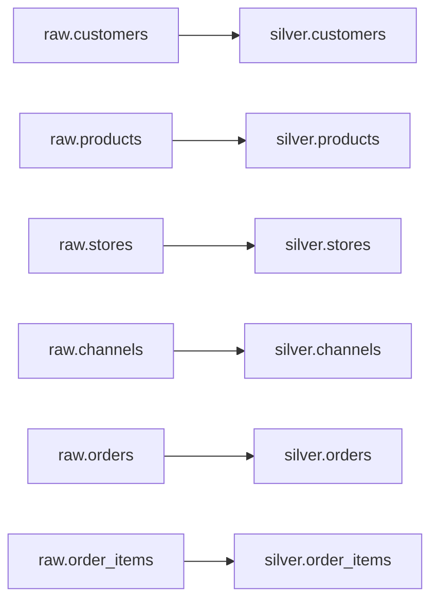

# Lineage

RetailDQ writes lineage summaries for each run in `data/gold/{run_id}/lineage.md` and `.json`.

## Entity Flow

## Gold Marts

| Gold output | Inputs |
| --- | --- |
| `revenue_by_day` | `silver.orders`, `silver.order_items` |
| `revenue_by_channel` | `silver.orders`, `silver.order_items` |
| `revenue_by_store` | `silver.orders`, `silver.order_items`, `silver.stores` |
| `order_count_by_day` | `silver.orders` |
| `average_order_value` | `silver.orders`, `silver.order_items` |
| `top_products_by_revenue` | `silver.order_items`, `silver.products` |
| `top_products_by_quantity` | `silver.order_items`, `silver.products` |
| `invalid_record_counts` | `quarantine` |
| `data_quality_pass_fail_summary` | DQ summaries |
| `pipeline_run_metadata` | Orchestration metadata |
